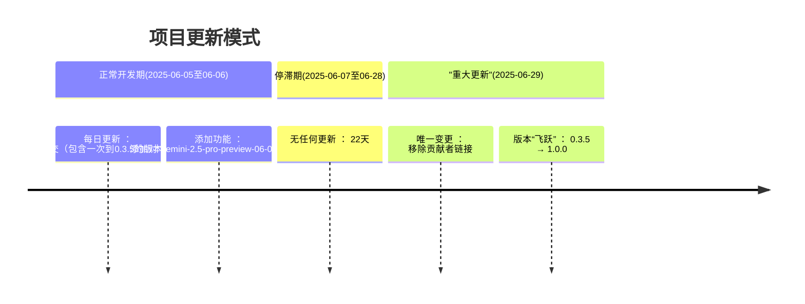
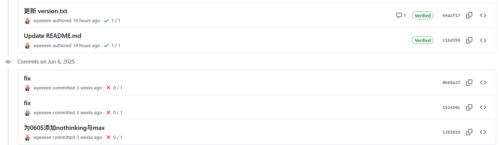
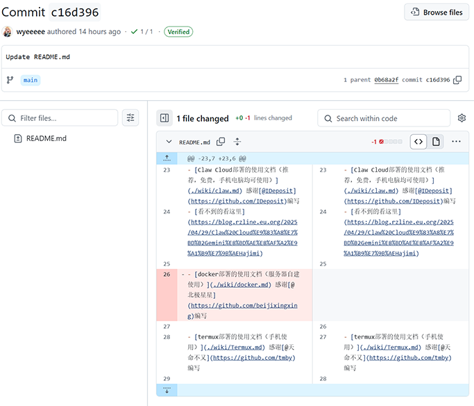
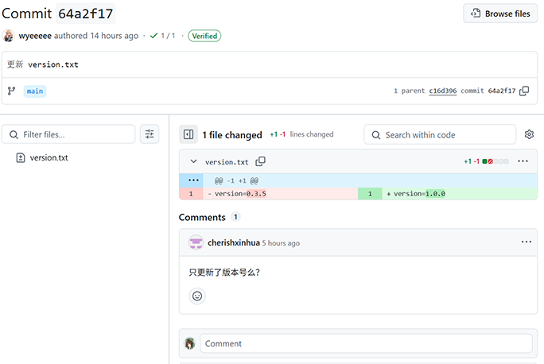

# 项目治理事件记录

## 事件概述

2025年6月28日，在项目停滞近一个月后（最后更新为2025-06-06），项目主导者进行了以下操作：

1. 移除了贡献者[@北极星星](https://github.com/beijixingxing)在README中的文档链接
2. 将版本号从0.3.5升级至1.0.0

## 事实核查

### 版本变更内容分析

| 指标   | 0.3.5 → 1.0.0                         |
|------|---------------------------------------|
| 代码变更 | 20行左右                                 |
| 功能新增 | 添加了对"gemini-2.5-pro-preview-06-05"的支持 |
| 文档更新 | -1项（移除贡献者链接）                          |
| 有效提交 | 仅version.txt修改                        |

## 项目更新模式分析

